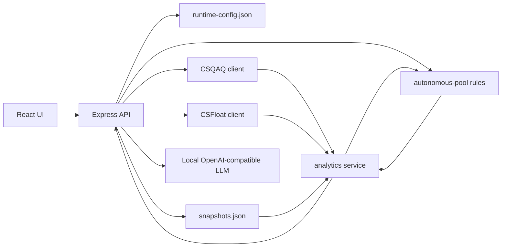

# CS2 Monitor Architecture

## Overview
This project is a local CS2 market monitoring platform. It keeps the existing React/Vite frontend and Express/TypeScript backend, while adopting a stricter workflow inspired by the auto-coding reference package: small stories, explicit verification, persistent project memory, and health visibility.

## Engineering Workflow
New feature and optimization work should follow this loop:

1. Read `AGENTS.md`, `docs/progress.md`, and this architecture document.
2. Translate the request into a user story or task plan with target behavior, affected modules, risks, and acceptance checks.
3. Confirm the plan with the user before large or risky edits.
4. Implement in small steps, preserving existing API paths and runtime data shape unless the plan explicitly changes them.
5. Add or update focused tests for the risk area.
6. Verify with `npm exec tsc -- --noEmit`, `npm test`, and `npm run build`.
7. Review the changed areas. If the user explicitly asks for subagents, split review by data, backend, frontend, and tests/docs before finalizing.
8. Update `docs/progress.md` and test documentation when the change alters project status, known patterns, or coverage.

## Runtime Flow

## Backend Responsibilities
- `server/index.ts` assembles Express middleware, clients, routes, and runtime loops.
- `server/config-store.ts` owns runtime configuration persistence and token masking.
- `server/history-store.ts` owns snapshot persistence, write serialization, backup recovery, and history limits.
- `server/analytics.ts` owns item normalization, indicators, scoring, recommendations, holder behavior, and LLM fallback orchestration.
- `server/autonomous-pool.ts` owns deterministic autonomous recommendation prefiltering, admission scoring, pool assignment, supply grading, evidence, and risk tags. It does not use LLM output for hard decisions.
- `server/item-taxonomy.ts` owns item classification, recommendation scopes, sticker series normalization, and scanner matching.

## Autonomous Recommendation Flow
- Candidate sources are loaded by scanner scope, then passed through a deterministic prefilter before windowing and random sampling.
- Hard excluded candidates such as StatTrak, Souvenir, music kits, non-target stickers, and active-drop cases do not fall back into the sample pool when the filtered pool is small.
- Analyzed items receive an `autonomousPool` decision with pool, admission score, supply grade, entry/alert eligibility, reasons, risk tags, and evidence source.
- `/api/recommendations` includes `scanner.preFilter` diagnostics so the UI can show raw candidates, accepted candidates, rejects, shortage state, reject reason counts, and pool distribution.
- v1 deliberately marks unsupported signals as degraded rather than pretending to know them: precise trade-up EV, full-network inventory, unique sticker craft demand, team heat, and authoritative live drop-pool state need future data sources or maintained rule tables.

## Frontend Responsibilities
- `src/App.tsx` coordinates app-level state, routes, and data loading.
- `src/hooks/*` isolate API fetch and mutation flows.
- `src/components/pages/*` render page-level workflows.
- `src/components/charts/*` builds chart options and lazy-loads ECharts.
- `shared/types.ts` is the API contract source used by both frontend and backend.

## Data And Safety
- `data/runtime-config.json` and `data/snapshots.json` are local runtime files and must stay out of Git.
- API tokens may come from runtime config or environment variables.
- The reference auto-coding package is ignored because it is not part of the product source and may contain secrets.
- Snapshot writes are serialized to avoid lost updates during auto-refresh, manual refresh, and scanner activity.

## Health Visibility
The backend exposes a lightweight health report through `/api/health`, including data source configuration, watchlist size, portfolio size, snapshot counts, auto-refresh status, scanner status, and the latest runtime error.
